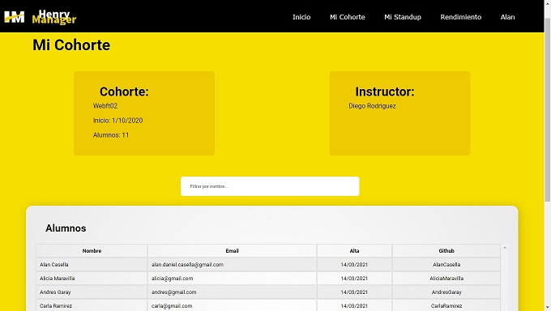
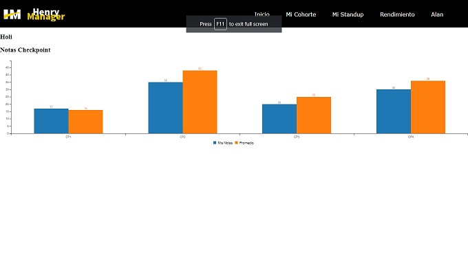
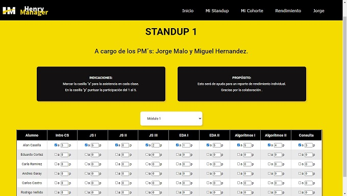
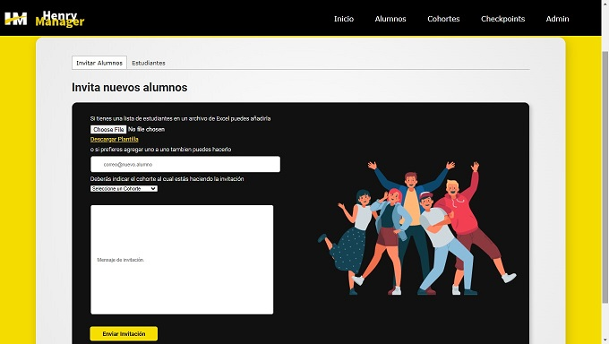
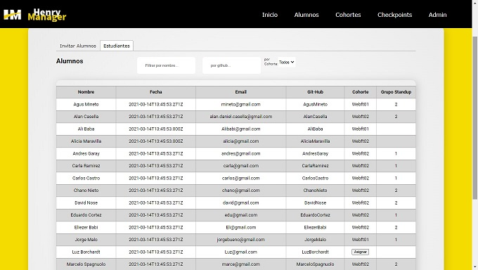
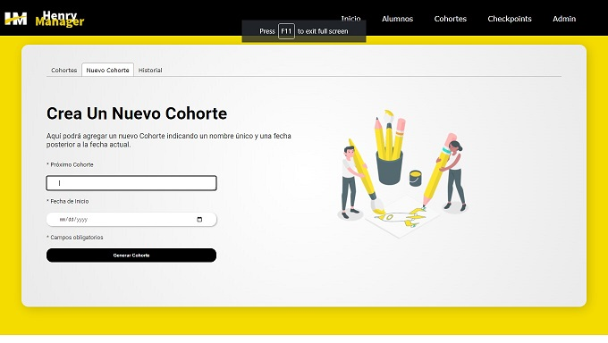
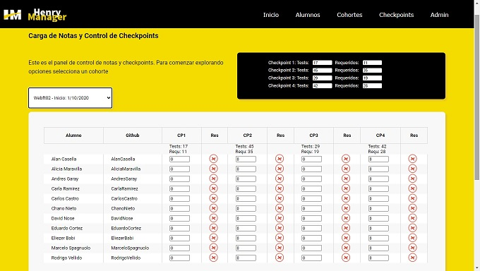
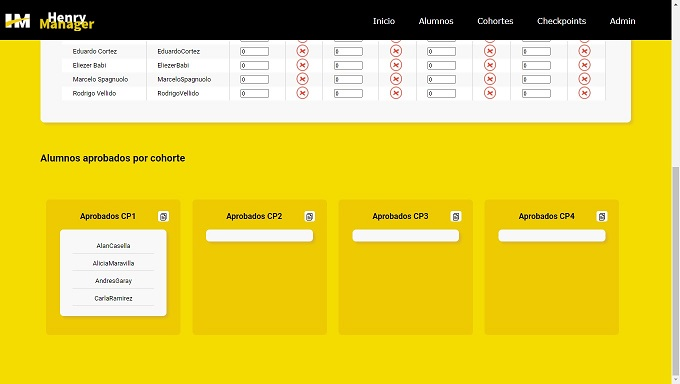

<b>HENRY MANAGER</b>

PRESENTATION 
This final project was realized during Henry bootcamp, in a group of several people, applying scrum methodology and technologies learnt during the bootcamp plus others that were learned during this project.

TECHGNOLOGIES 
The principal technologies used where: <b>Typescript</b> as a general language. <b>React</b>, <b>Redux</b> and <b>Router</b> for the design in the FrontEnd components, <b>Axios</b> for reaching Backend endpoints. <b>NodeJs</b>, <b>Express</b> for Backend development. <b>Bcrypt</b> for password hashing. <b>Passport</b> for local strategies to login users along with <b>JsonWebToken</b> with protected routes. <b>Mailgun</b> as a mail delivering services. <b>Multer</b> to upload Images. <b>Xlxs</b> to manage spreadsheet and <b>C3Js</b> to create graphics.

LOGIN 
The home of the app is the login since the users are invited through an email where they have to register. Only after they are invited, registered and logged in the app starts displaying information depending on the role the user was given.

  
STUDENTS 
They have access to read-only components, like their test scores, their data, etc.

  
TEACHERS ASSISTANTS 
Since they are also a student, they have the same access to the read-only components, but also access to attendance editing and participation of the students in the StandUp groups they belong to.

  
ADMIN 
Access to student control panel and management.

  
Management, creation and control of cohorts.

  
Management and loading of student's test scores.

  
CONTRIBUTORS

<ul>
  <li><a href="https://github.com/AlanCasella">Alan Casella</a></li>
  <li><a href="https://github.com/MarceloSpagnuolo">Marcelo Spagnuolo</a></li>
  <li><a href="https://github.com/carlirows">Carlos Castro</a></li>
  <li><a href="https://github.com/Daniel-Ignacio-Nieto">Daniel Ignacio Nieto</a></li>
  <li><a href="https://github.com/babinobass">Eliezer Salazar</a></li>
  <li><a href="https://github.com/ellyanalion">Carla Ramírez</a></li>
  <li><a href="https://github.com/andresogc">Andres Garay</a></li>
  <li><a href="https://github.com/v1scount">Rodigo Vellido</a></li>
</ul>